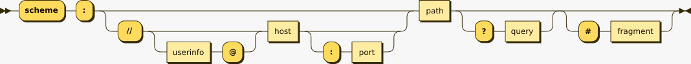
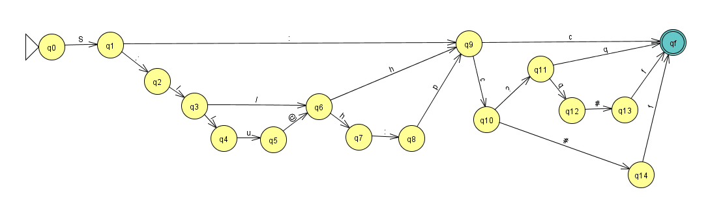

# URI recognizer as a Nondeterministic Finite Automaton (NFA)

Uma Uniform Resource Locator, ou URL, se trata de uma referência a um recurso que especifica sua localização em uma rede como a internet. Toda URL é um tipo de Uniform Resource Identifier (URI), que representa uma sequência única de caracteres que identificam recursos genéricos, que vão desde as páginas da web até endereços de e-mail. URLs típicas, como https://www.inf.ufrgs.br/site/, são compostas pela sintaxe de uma URI genérica, tendo um scheme (https), um host (www.inf.ufrgs.br) e um path (site). Existem outros elementos que podem compor a sintaxe, como userinfo, port, query e fragment.

`URI = scheme ":" ["/" "/" [userinfo "@"] host [":" port] ] path ["?" query] ["#" fragment]`


Diagrama da sintaxe genérica de uma URI

O scheme e o path são sempre definidos para todas as palavras válidas da sintaxe. Os outros componentes têm alguns delimitadores associados.

- `scheme`: componente acompanhado de um delimitador dois-pontos ( : ). Alguns schemas populares são http, https, ftp, mailto, file, data, entre outros.
- `authority`: componente opcional, precedido por duas barras ( // ) e composto pelos sub-componentes userinfo e host.
- `userinfo`: opcional, seguido pelo símbolo arroba ( @ ), consiste em um nome de usuário e uma senha opcional.
- `host`: consiste de um nome registrado, que pode ser um hostname ou endereço de IP.
- `port`: opcional, precedido pelo símbolo dois-pontos ( : ), consiste de um conjunto dígitos que corresponde ao endpoint para um serviço específico.
- `path`: realiza o mapeamento para um caminho no sistema de arquivos, através de referências lógicas.
- `query`: opcional, precedido do símbolo interrogação ( ? ), consiste em uma string de consulta para dados não-hierárquicos.
- `fragment`: opcional, precedido do símbolo hash ( # ), consiste de um identificador que direciona para um recurso secundário, como seções de um heading em HTML. 

Existem outros símbolos e sub-componentes que, para fins de viabilidade e simplificação, não foram considerados no escopo deste trabalho.

# Definição da linguagem

`Lc = {S, :, /, h, u, p, c, q, f, ?, @, #}`


| Símbolo | Descrição do símbolo                                      |
|---------|-----------------------------------------------------------|
| :       | Símbolo ASCII dois-pontos, sucede um schema e precede um port |
| /       | Símbolo ASCII de barra, que precede o componente authority |
| S       | Schema, que pode representar protocolos para páginas web HTTP ou HTTPs, protocolo de transferência de arquivos FTP, protocolo para e-mail mailto, entre outros |
| h       | Host, consiste de um nome registrado, que pode ser um hostname ou endereço de IP |
| u       | Userinfo, consiste em um nome de usuário e uma senha opcional |
| p       | Port, consiste de um conjunto de dígitos que corresponde ao endpoint para um serviço específico |
| c       | Path (caminho), realiza o mapeamento para um caminho no sistema de arquivos, através de referências lógicas |
| q       | Query, consiste em uma string de consulta para dados não-hierárquicos |
| f       | Fragment, consiste de um identificador que direciona para um recurso secundário, como seções de um heading em HTML |
| #       | Símbolo ASCII hash que precede o fragment |
| @       | Símbolo ASCII arroba que sucede o userinfo |
| ?       | Símbolo ASCII interrogação que precede a query |


# AFN que reconhece a linguagem


# Regras de formação das palavras

## Exemplos de palavras em ACEITA(MC):
- S:c
- S://hc
- S://h:pc
- S://u@h:pc
- S://u@h:pc?q#f

## Exemplos de palavras em REJEITA(MC):
- SS:/c
- S:/c
- S://ch:p
- S://u@h:p#f?q
- S://u@h:p

# Tutorial

Desenvolvido em Python 3.10.12.

Para utilizar a AFN que representa a URI genérica e a lista de palavras proposta:

`python3 main.py -p entrada -c listadepalavras.csv -l -r`

---

A estrutura da chamada do programa e seus argumentos são os seguintes:

`python3 main.py -p <CAMINHO-PROG-ENTRADA> -c <CAMINHO-CSV-PALAVRAS> -l -r`

onde:

    -p: caminho do programa de entrada

    -c: caminho do .csv com a lista de palavras

    -l: opção para exibir no terminal a lista de palavras completa
    
    -r: opção para exibir a lista de palavras rejeitadas pelo AF

## Arquivos

### Programa

O formato do arquivo de entrada que contém a definição do AFN deve seguir o padrão:

```
<M>=({<s1>,...,<sn>}, {<q0>,...,<qn>}, <ini>, { <f0>,...,<fn>}) 
Prog 
(<q0>,<s1>)={<q1>,<q2>} 
... 
(<qn>,<sn>)={<q0>}
```
onde: 

    < M >: nome dado ao autômato;

    < si >: para 1 ≤ i ≤ n, com n ∈ N e n ≥ 1, representa um símbolo do alfabeto da linguagem reconhecida pelo autômato; 
    
    < qi >: para 0 ≤ i ≤ n, com n ∈ N e n ≥ 0, representa um estado do autômato; 
    
    < ini >: indica o estado inicial do autômato, sendo que ini é um estado do autômato; 
    
    < f i >: para 0 ≤ i ≤ n, com n ∈ N e n ≥ 0, representa um estado final do autômato, sendo que f i é um estado do autômato; 
    
    (< qi >, < si >) = {< qj >, < qk >}: descreve a função programa aplicada a um estado qi e um símbolo de entrada si que leva a computação ao conjunto de estados {< qj >, < qk >}.

### Lista de palavras

O arquivo com lista de palavras deve conter as palavras separadas por vírgula, ou seja, em formato .csv.

---
UNIVERSIDADE FEDERAL DO RIO GRANDE DO SUL

INSTITUTO DE INFORMÁTICA

INF05005 - Linguagens Formais e Autômatos - Prof. Lucio Mauro Duarte

Trabalho teórico-prático, 2024/1

Dennis Pereira Krigger

Leonardo Azzi Martins